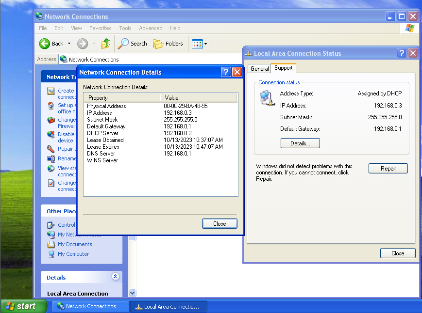

# Project DHCP
## Membuat Server DHCP Menggunakan Debian

Pertama, kalian membutuhkan dua OS yang menjadi Server dan Client. Untuk ini kita menggunakan Virtual Machine Debian untuk Server dan Windows XP untuk Client.

Setelah menginstall Debian dan memasuki login ```root```, kita butuh menginstall DHCP Servernya sebelum memulai mengkonfigurasinya.

### 1. Konfigurasi IP

Langkah pertama kita harus mengkonfigurasikan IP interface dengan menjalankan perintah dan masukkan kode berikut:  
```
nano /etc/network/interfaces
```
```
auto eth0
iface eth0 inet static
    address 192.168.0.2
    netmask 255.255.255.0
    network 192.168.0.0
    gateway 192.168.0.1
```
Setelah itu, kita akan restart interface eth0 agar dapat menggunakan 
### 2. Menginstall DHCP Server

Selanjutnya kalian akan menginstall DHCP Servernya dengan menjalankan perintah berikut:
```
apt-get install isc-dhcp-server
```
### 3. Mengkonfigurasi DHCP Server

Setelah menginstall DHCP, kita akan mengkonfigurasi servernya dengan menjalankan perintah berikut:
```
nano /etc/dhcp/dhcpd.conf
```
Dan selanjutnya kita mengubah pada line
```
# A slightly different configuration for an internal subject.
subnet 192.168.0.0 netmask 255.255.255.0 {
    range 192.168.0.2 192.168.0.140;
    option-domain-name-servers 192.168.0.2;
    option-domain-name "debian.net";
    option routers 192.168.0.1;
    option broadcast-address 192.168.0.255;
    default-lease-time 600;
    max-lease-time 7200;
}
```
Setelah itu kita akan mengkonfigurasikan interface yang DHCP server akan menggunakan dengan perintah:
```
nano /etc/default/isc-dhcp-server
```
dan tambah di bawah file
```
INTERFACES="eth0"
```
Dan hasilnya seharusnya seperti berikut:
